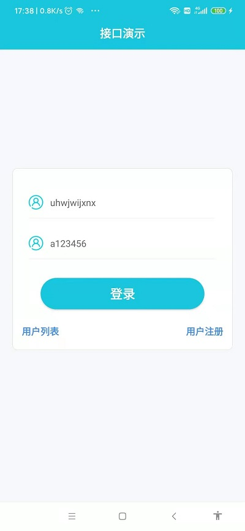
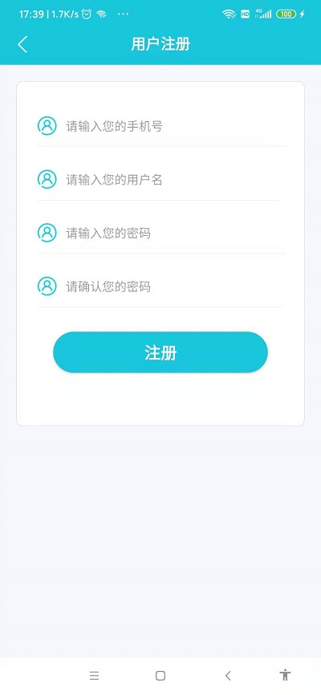
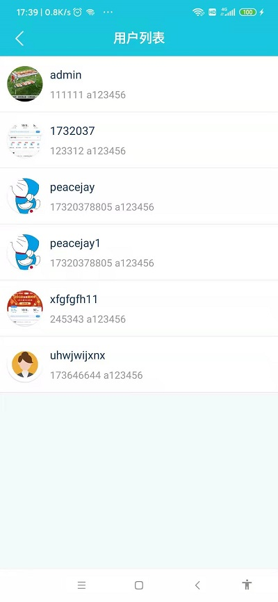
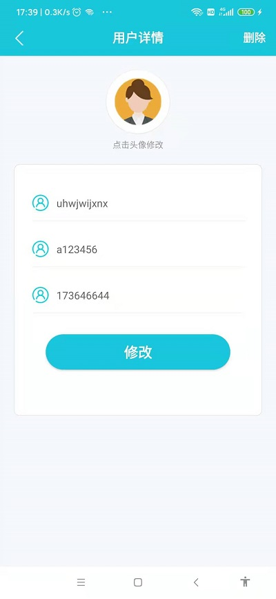
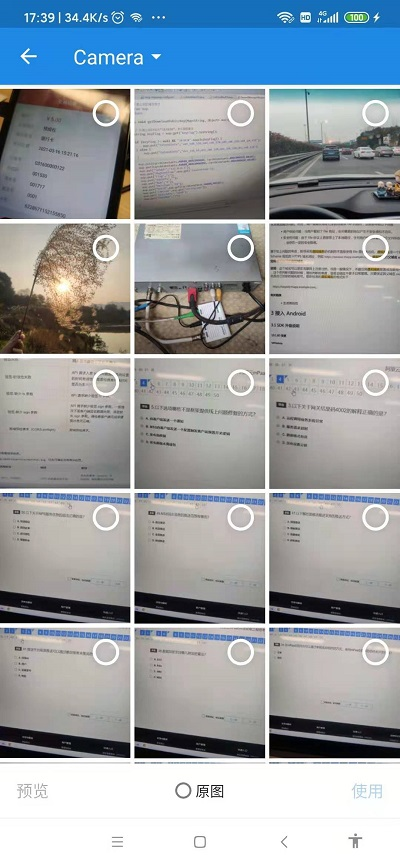

#项目说明
    androidDemo 前端框架；
    JavaDemo 后端框架；
    
#框架功能列表
    MVVM模式
    网络访问 okhttp3、retrofit2
    异步任务 rxjava、rxandroid
    日志打印 logger
    JSON解析 gson
    RecyclerView框架 BaseRecyclerViewAdapterHelper
    动态权限申请 permission
    SmartRefreshLayout刷新
    数据传递 eventbus
    图片显示 glide
    图片选择框架 matisse
    屏幕适配方案 autosize

#关联后端项目 
    https://github.com/764990722/JavaDemo
  
#接口列表
    注册，登录，查询，修改资料，表单上传头像，删除

#效果演示
  

      

